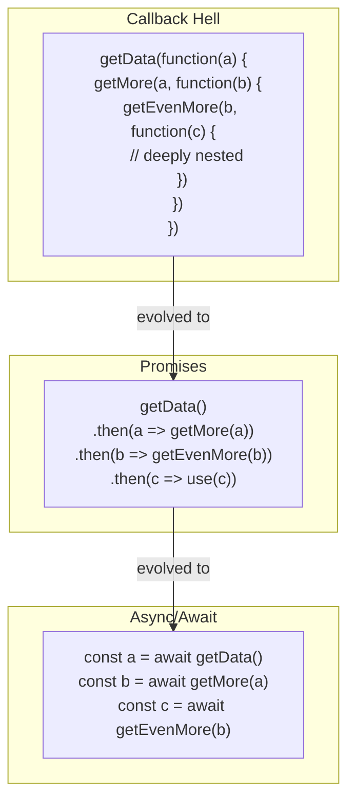

# Async Programming

JavaScript is single-threaded. To do slow things (network requests, file reads) without blocking, you use async code.

## The evolution



### Callbacks — the original way

Pass a function that runs when the operation completes:

```typescript
setTimeout(() => {
  console.log("1 second later")
}, 1000)
```

Callbacks work for one operation. They break down when you chain operations:

```typescript
getUser(id, (user) => {
  getOrders(user.id, (orders) => {
    getOrderItems(orders[0].id, (items) => {
      getProduct(items[0].productId, (product) => {
        // this keeps nesting. "callback hell"
      })
    })
  })
})
```

### Promises — flatten the chain

A Promise represents a value that will be available later.

```typescript
const fetchUser = (id: number): Promise<User> => {
  return new Promise((resolve, reject) => {
    // async operation
    if (found) resolve(user)
    else reject(new Error("not found"))
  })
}
```

Chain with `.then()`:

```typescript
fetchUser(1)
  .then(user => fetchOrders(user.id))
  .then(orders => fetchOrderItems(orders[0].id))
  .then(items => fetchProduct(items[0].productId))
  .then(product => console.log(product))
  .catch(error => console.error(error))
```

Flat instead of nested. Error handling in one `.catch()`.

### async/await — write async code that looks sync

`async/await` is syntactic sugar over Promises. The most readable form:

```typescript
async function getProductForUser(userId: number): Promise<Product> {
  try {
    const user = await fetchUser(userId)
    const orders = await fetchOrders(user.id)
    const items = await fetchOrderItems(orders[0].id)
    const product = await fetchProduct(items[0].productId)
    return product
  } catch (error) {
    throw new Error(`Failed to get product: ${error}`)
  }
}
```

Step by step:
1. `async` marks the function as asynchronous. It always returns a Promise.
2. `await` pauses the function until the Promise resolves. The value is unwrapped.
3. `try/catch` handles errors from any `await` in the block.

## Running in parallel

When operations don't depend on each other, run them concurrently:

```typescript
async function loadDashboard(userId: number) {
  const [user, notifications, settings] = await Promise.all([
    fetchUser(userId),
    fetchNotifications(userId),
    fetchSettings(userId),
  ])
  return { user, notifications, settings }
}
```

`Promise.all` runs all promises at the same time. You wait for all of them, not each one sequentially.

## The rule

Use `async/await`. Always. It is the standard. Callbacks are legacy. Raw `.then()` chains are rare. `async/await` is what you will write every day.
