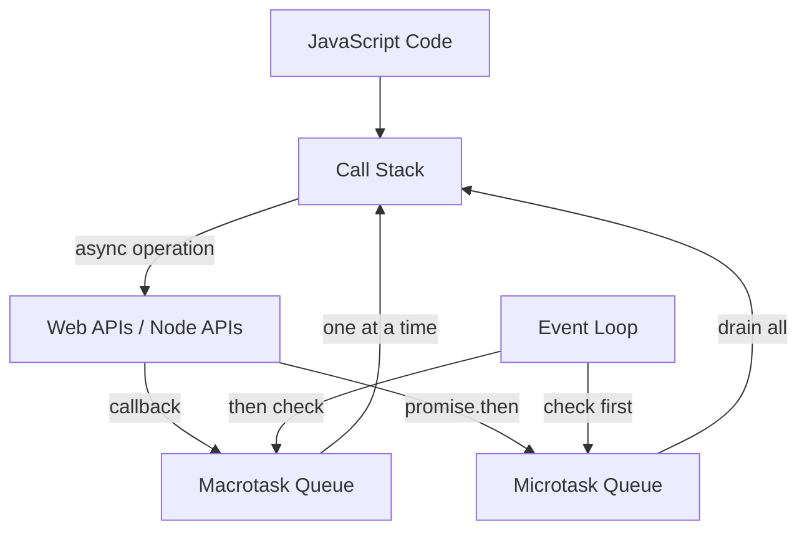
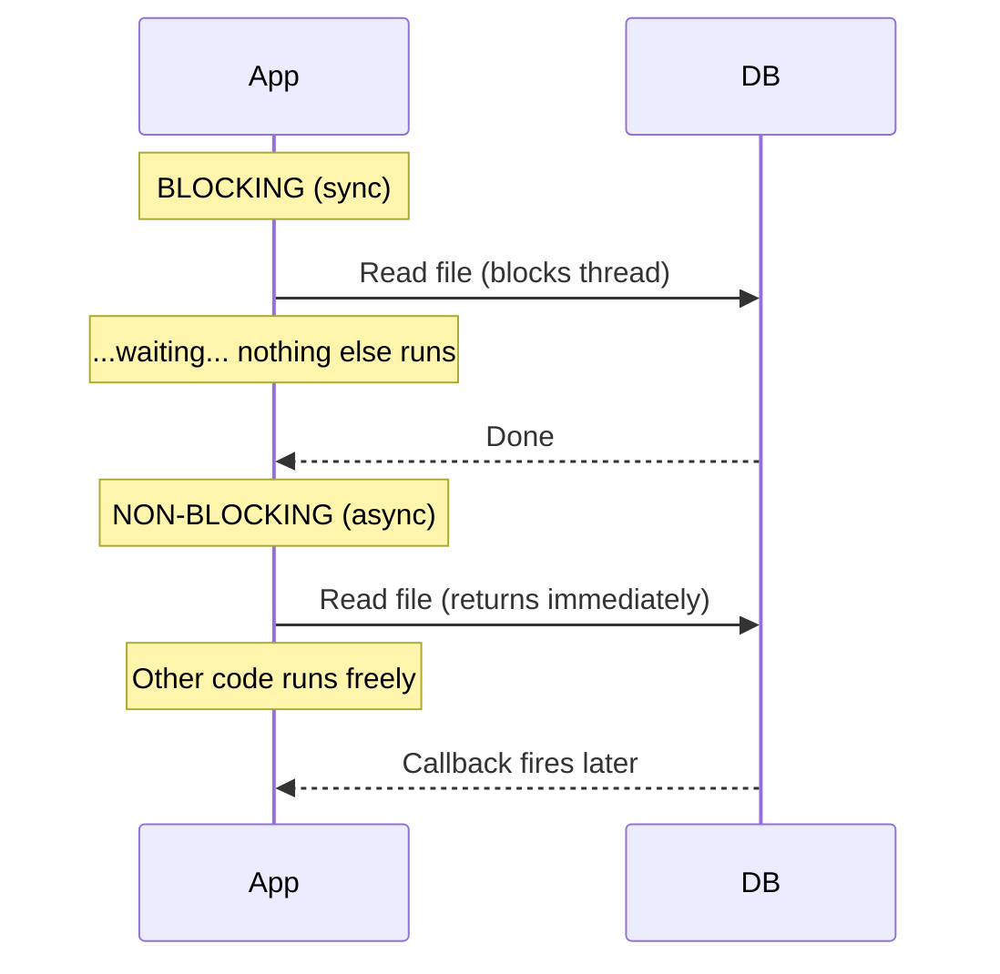

# The Event Loop

JavaScript is single-threaded. One line of code runs at a time. Yet it handles thousands of concurrent requests. The event loop is how.

## The mental model

Think of the event loop as a while loop:

```
while (queue has tasks) {
  take next task
  run it to completion
  check for new tasks
}
```

Each task runs to completion. No other code runs in parallel within the same thread. This is why you never block: a slow operation blocks everything.

## How async fits

When you call an async operation (file read, network request, timer), this happens:

1. You call the async function
2. The runtime sends the operation to the system (kernel, libuv, etc.)
3. Your code continues. The event loop processes other tasks.
4. When the operation completes, a callback is queued.
5. The event loop picks up the callback and runs it.

```typescript
console.log("1")

setTimeout(() => {
  console.log("3")
}, 0)

console.log("2")
```

Output: `1`, `2`, `3`. Even with a 0ms delay, the callback is queued, not run immediately. The current task finishes first.

## Microtasks vs macrotasks



There are two queues:

**Microtask queue** — Promises, `queueMicrotask()`. Runs after every task, before the next macrotask.

**Macrotask queue** — `setTimeout`, `setInterval`, I/O callbacks. One macrotask per event loop tick.

```typescript
console.log("1")

setTimeout(() => console.log("2"), 0)

Promise.resolve().then(() => console.log("3"))

console.log("4")
```

Output: `1`, `4`, `3`, `2`.

Step by step:
1. `console.log("1")` — synchronous, runs immediately
2. `setTimeout` — macrotask, queued
3. `Promise.resolve().then()` — microtask, queued
4. `console.log("4")` — synchronous, runs immediately
5. Microtask queue drains: `3`
6. Next macrotask: `2`

## Why this matters for backend



A single slow synchronous operation blocks the entire server. Every request waits.

```typescript
// BAD: blocks the event loop for all users
app.get("/slow", () => {
  const result = heavyComputation()  // takes 5 seconds
  return result
})
```

```typescript
// GOOD: yields to the event loop
app.get("/fast", async () => {
  const result = await fetchData()  // I/O is async, other requests can be served
  return result
})
```

The rule: keep the event loop free. Use async I/O. Offload heavy CPU work to worker threads or external services.
