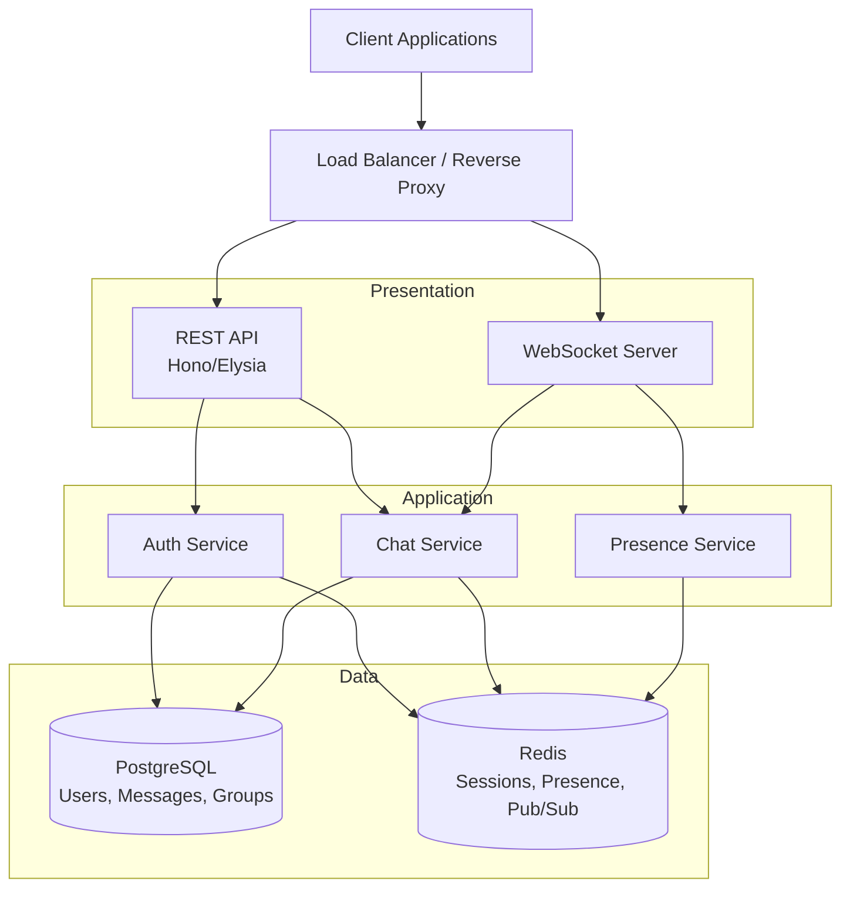
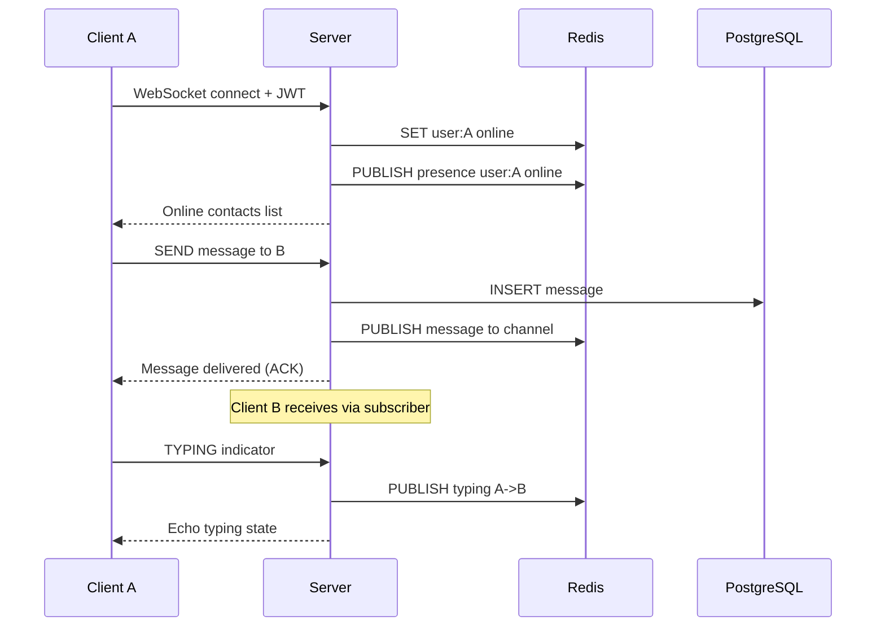

# Workshop Project: Real-time Chat Application

**Roadmap:** JavaScript & TypeScript Backend (Bun + Hono/Elysia)
**Architecture:** 3-tier
**Challenge Repo:** https://github.com/TP-Coder-Innovation-Hub/realtime-chat-application-challenge

---

## Business Context

Build a real-time chat application that supports direct messaging, group conversations, and presence awareness. The system must handle concurrent WebSocket connections, persist message history, and provide low-latency typing indicators and read receipts. This project validates full-stack backend competency using modern TypeScript runtimes and frameworks.

---

## Learning Objectives

- Design a 3-tier architecture with clear separation of concerns
- Implement JWT authentication with token refresh and revocation
- Build WebSocket-based real-time features with Redis pub/sub
- Model relational data in PostgreSQL for chat history and user management
- Achieve end-to-end type safety from request to response
- Containerize multi-service applications with Docker Compose
- Write architecture decision records for key technical choices

---

## Architecture

---

## Feature Requirements

### 1. User Registration & Authentication

Users can register, log in, and maintain authenticated sessions.

**Acceptance Criteria:**

- POST `/auth/register` — creates user with email and hashed password
- POST `/auth/login` — returns access token (15min) and refresh token (7d)
- POST `/auth/refresh` — exchanges refresh token for new access token
- POST `/auth/logout` — invalidates refresh token via Redis blacklist
- Passwords hashed with bcrypt or Argon2
- Duplicate email registration returns 409
- Invalid credentials return 401
- All protected routes reject expired or invalid tokens

### 2. Direct Messaging

Users can send and receive real-time 1-on-1 messages.

**Acceptance Criteria:**

- WebSocket event `direct:message` sends a message to a specific user
- Server validates that both users share an active conversation
- Messages stored in PostgreSQL with `id`, `sender_id`, `recipient_id`, `content`, `created_at`
- Offline messages queued and delivered when recipient comes online
- Client receives delivery confirmation via `message:ack` event

### 3. Group Chats

Users can create group conversations and manage membership.

**Acceptance Criteria:**

- POST `/groups` — creates a group (creator auto-joined as admin)
- POST `/groups/:id/members` — adds member (admin only)
- DELETE `/groups/:id/members/:userId` — removes member (admin or self)
- GET `/groups` — lists user's groups
- GET `/groups/:id/messages` — paginated group message history
- WebSocket event `group:message` broadcasts to all group members
- Non-members cannot send or read group messages (returns 403)

### 4. Message Persistence

All messages persist in PostgreSQL with paginated retrieval.

**Acceptance Criteria:**

- GET `/conversations/:id/messages?cursor=&limit=50` — cursor-based pagination
- Messages ordered by `created_at` descending
- Each message includes sender profile (id, username, avatar)
- Cursor pagination returns `next_cursor` and `has_more` fields
- No N+1 queries — use joins or batched loading
- Database schema enforces foreign keys and appropriate indexes

### 5. Typing Indicators & Read Receipts

Real-time feedback on message composition and consumption.

**Acceptance Criteria:**

- WebSocket event `typing:start` — published to recipient(s) via Redis pub/sub
- WebSocket event `typing:stop` — auto-emitted after 3s inactivity or on message send
- WebSocket event `message:read` — marks message as read in PostgreSQL
- GET `/conversations/:id/unread` — returns unread count
- Typing events not persisted (ephemeral, Redis-only with TTL)
- Read receipts update a `last_read_at` timestamp per conversation per user

### 6. Online/Offline Presence

Track and broadcast user availability in real-time.

**Acceptance Criteria:**

- On WebSocket connect: `SET user:{id} online` in Redis with 30s TTL
- Heartbeat: client sends ping every 10s, server resets TTL
- On disconnect: `DEL user:{id}` and `PUBLISH presence user:{id} offline`
- GET `/users/online` — returns list of online user IDs
- Presence changes broadcast to subscribed contacts via Redis pub/sub
- No stale presence — TTL ensures cleanup if heartbeat stops

---

## Tech Constraints

| Constraint | Requirement |
|---|---|
| Runtime | Bun (no Node.js) |
| Framework | Hono or Elysia |
| Language | TypeScript strict mode, zero `any` types |
| Real-time | WebSocket (native Bun or framework adapter) |
| Database | PostgreSQL 15+ |
| Cache/Pub-Sub | Redis 7+ |
| Type Safety | End-to-end: typed routes, validated input, typed responses |
| Validation | Schema validation library (zod, typia, or valibot) |
| Containerization | Docker Compose with `bun`, `postgres`, `redis` services |
| Migrations | Database migrations via script or ORM tool |
| No ORM restriction | Raw SQL, Drizzle, Kysely, or Prisma — your choice |

---

## Architecture Decision Records

### ADR-001: Bun over Node.js

**Context:** Choose a JavaScript/TypeScript runtime for the project.

**Decision:** Use Bun as the runtime.

**Rationale:** Bun provides native TypeScript execution without a build step, built-in WebSocket support, a native SQLite client (with pg driver compatibility), and faster cold starts. The roadmap targets Bun as the primary runtime, making this the practical choice.

**Consequences:** Bun's ecosystem is smaller than Node.js. Some npm packages may have compatibility issues. Native test runner and bundler reduce toolchain complexity.

---

### ADR-002: Hono or Elysia as HTTP Framework

**Context:** Choose an HTTP framework optimized for Bun.

**Decision:** Use Hono or Elysia (developer's choice).

**Rationale:** Hono offers edge-runtime portability and a lightweight middleware model. Elysia provides end-to-end type safety via Eden and schema-based validation out of the box. Both have first-class Bun support and WebSocket handlers.

**Consequences:** Lock-in to the chosen framework's patterns. Elysia's type inference is tighter but less portable. Hono is more widely adopted across runtimes.

---

### ADR-003: Redis for Presence and Pub/Sub

**Context:** Manage online/offline state and broadcast real-time events across potential multiple server instances.

**Decision:** Use Redis for ephemeral state (presence, typing) and pub/sub (message fan-out).

**Rationale:** Presence data is short-lived and high-frequency — a poor fit for PostgreSQL. Redis TTL handles stale presence cleanup automatically. Pub/sub decouples message broadcasting from the application server, enabling horizontal scaling.

**Consequences:** Redis becomes a critical infrastructure dependency. Data in Redis is volatile — persistence-layer concerns (messages, users) must remain in PostgreSQL.

---

### ADR-004: Cursor-Based Pagination for Messages

**Context:** Load chat message history efficiently.

**Decision:** Use cursor-based (keyset) pagination on `created_at` + `id`.

**Rationale:** Offset-based pagination degrades with large datasets and produces inconsistent results when new messages arrive during pagination. Cursor pagination uses an indexed compound key, guaranteeing stable results at O(1) seek time.

**Consequences:** Clients must track the cursor. No random page access. This is the standard pattern for chat applications.

---

### ADR-005: JWT with Refresh Token Rotation

**Context:** Authenticate WebSocket connections and REST API requests.

**Decision:** Short-lived access tokens (15min) + long-lived refresh tokens (7d) stored in Redis.

**Rationale:** WebSocket connections require stateless auth verification on connect. Short-lived tokens limit exposure on compromise. Refresh tokens stored in Redis enable immediate revocation on logout.

**Consequences:** Token refresh flow adds complexity. Refresh tokens must be transmitted securely (http-only cookie or authorization header). Logout requires a Redis write to blacklist the token.

---

## Submission Checklist

- [ ] Repository forked from challenge repo and all code pushed
- [ ] `docker-compose up` starts all services (app, postgres, redis) with no manual setup
- [ ] TypeScript compiles with zero errors in strict mode
- [ ] No `any` types anywhere in the codebase
- [ ] All 6 feature sets implemented with passing acceptance criteria
- [ ] End-to-end type safety demonstrated (typed request → validated → typed response)
- [ ] Database migrations run automatically on container start
- [ ] WebSocket connections authenticated via JWT
- [ ] Redis handles presence, typing indicators, and pub/sub
- [ ] Cursor-based pagination on message history endpoints
- [ ] 3-5 architecture decision records written
- [ ] API documentation (OpenAPI spec or typed route documentation)
- [ ] Seed script or fixture data for testing
- [ ] README with setup instructions, architecture overview, and ADR index
