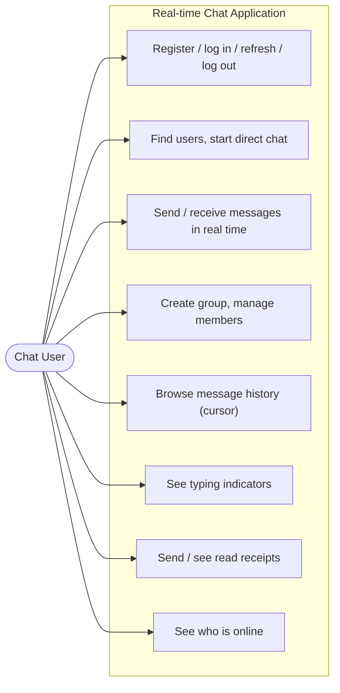
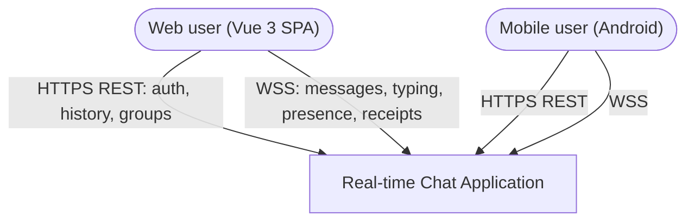
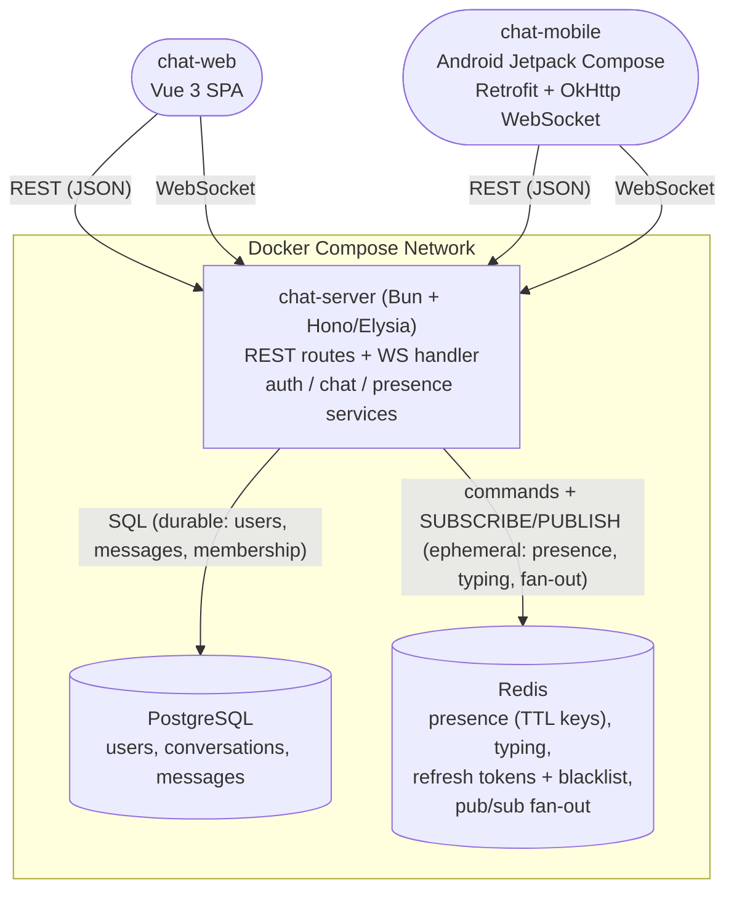
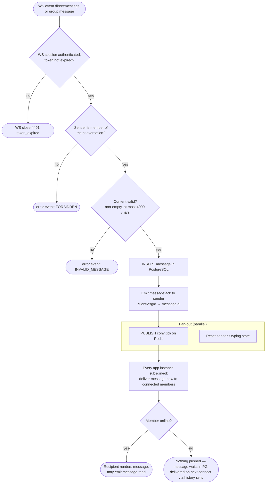
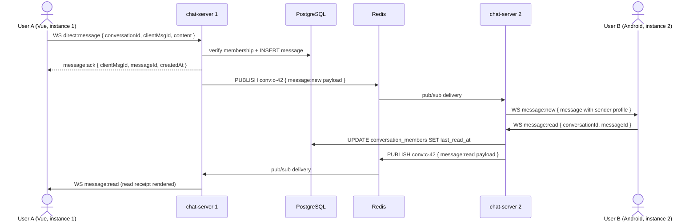
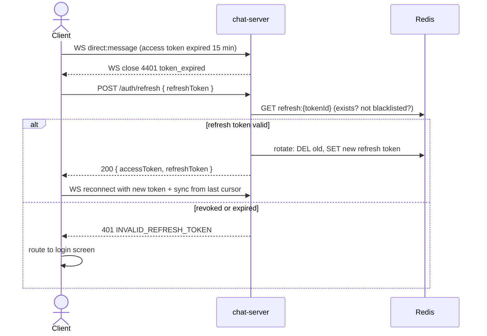
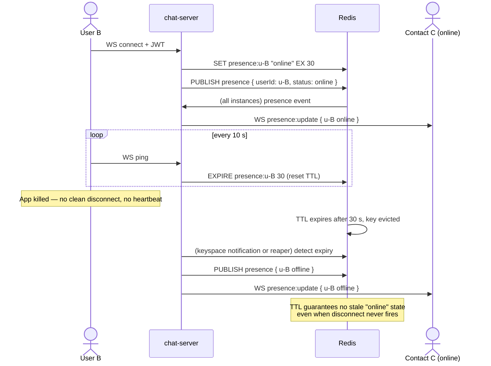

# Workshop Design: Real-time Chat Application

> Companion to [01-workshop-spec.md](./01-workshop-spec.md). Diagrams, contracts, schemas — code organization is yours.

## Design Notes (read first)

1. **One conversation model for DMs and groups.** The spec describes direct messages with `sender_id`/`recipient_id` columns *and* endpoints like `GET /conversations/:id/messages` and per-conversation unread counts. Two parallel schemas (DM table + group table) would duplicate pagination, read receipts, and unread logic. This design unifies both: every chat is a `conversation` (`type: DIRECT | GROUP`), every message belongs to a conversation, and a DM is simply a 2-member conversation. The spec's *intent* (persisted DMs with sender/recipient) is preserved — the recipient is the other member.
2. **"Contacts" are derived, not managed.** Presence "broadcasts to subscribed contacts," but there's no friend system in scope. Contact = anyone you share a conversation with. No add/remove-friend endpoints — don't build them.
3. **Offline delivery = persistence + sync-on-connect.** Messages are durable in PostgreSQL the moment they're accepted. "Queued and delivered when recipient comes online" is implemented by the client syncing on reconnect (REST history from its last cursor + unread counts), not by a separate Redis queue. The `message:ack` event confirms server persistence, not recipient receipt — read receipts cover the latter.
4. **Two clients, one WebSocket protocol.** The Vue web app and the Android app speak the identical event contract in Part 5. If a feature needs a client-specific event, the protocol is wrong — fix the protocol.

---

## Part 1: High-Level Design

### 1.1 Use-Case Diagram



One human actor in two member roles (group `admin` vs `member` — affects UC4 only). No external system actors: the chat is self-contained.

### 1.2 System Context Diagram



### 1.3 Container Diagram



One app container (the 3 tiers are logical layers inside it), but every real-time event still round-trips through Redis pub/sub rather than in-process memory — that is what makes `docker compose up --scale app=2` work, and it's the architectural point of ADR-003. Don't shortcut it.

### 1.4 Activity Diagram — Send a Message (primary business process)



### 1.5 Sequence Diagrams

#### 1.5.1 Happy path — DM delivered across two app instances



#### 1.5.2 Error path — expired access token mid-session



#### 1.5.3 Async path — presence lifecycle with heartbeat TTL



---

## Part 2: Frontend Design

### 2.1 Frontend Justification

Both frontends serve the same actor — chat happens wherever the user is. Web (Vue 3) for desktop sessions; Android for mobile, where chat apps actually live. Building both proves the WebSocket protocol is client-agnostic (Design Note 4) and exercises reconnection behavior under mobile network conditions, which is half the difficulty of real-time systems.

### 2.2 Route Map (Vue 3) and Screen Map (Android)

**Vue 3 — chat-web**

| Route | Name | Purpose |
|---|---|---|
| `/login`, `/register` | Auth | Forms; on success store tokens, open WS |
| `/` | ChatList | Conversations ordered by last activity; unread badges; online dots; "new chat" |
| `/chat/:id` | ChatRoom | Message list (reverse infinite scroll via cursor), composer, typing indicator, read receipts |
| `/new` | NewChat | User search → opens/creates direct conversation |
| `/groups/new` | GroupCreate | Name + member picker |
| `/chat/:id/info` | ConversationInfo | Members; admin: add/remove; self: leave |
| `/:pathMatch(.*)*` | NotFound | 404 |

Pinia stores: `auth` (tokens, refresh timer), `conversations` (list + unread), `messages` (per-conversation pages keyed by cursor), `presence` (online set), `socket` (connection state machine: connecting / open / backoff).

**Android — chat-mobile (Navigation Compose)**

| Screen | Purpose |
|---|---|
| `LoginScreen` / `RegisterScreen` | Auth; tokens in EncryptedSharedPreferences |
| `ChatListScreen` | Same data as web ChatList; connection state banner ("connecting…") |
| `ChatRoomScreen` | LazyColumn reversed; paging on scroll-to-top; composer with typing emission |
| `NewChatScreen` | Debounced user search |
| `GroupCreateScreen` / `ConversationInfoScreen` | Group lifecycle |

### 2.3 Key UI Interactions

| Interaction | Behavior |
|---|---|
| WS lifecycle | Open after login; exponential backoff + jitter reconnect; on reconnect, re-sync each open conversation from its newest local message cursor (this *is* offline delivery — Design Note 3) |
| Token refresh | REST 401 or WS close 4401 → silent refresh → retry/reconnect once; refresh failure → login. Never loop |
| Sending | Optimistic append with `clientMsgId` and "sending" state → reconcile on `message:ack`; show retry affordance if no ack within 10 s |
| Typing | Emit `typing:start` on first keystroke, throttle 3 s; `typing:stop` on send or 3 s idle (client timer mirrors the server TTL) |
| Read receipts | Emit `message:read` for newest visible message when the room is focused/visible only — backgrounded apps must not mark messages read |
| Unread badges | From `GET /conversations/:id/unread` on load; incremented by `message:new` for unfocused conversations; cleared on read |
| Presence dots | From `presence:update` events; full refresh via `GET /users/online` on (re)connect |
| Cursor paging | Prepend older pages on scroll-up while preserving scroll position; `has_more=false` renders "beginning of conversation" |

---

## Part 3: API Contracts

Auth: `Authorization: Bearer <accessToken>` (REST) / `?token=` or first-message auth (WS connect). Error envelope: `{ "status": 409, "errorCode": "EMAIL_TAKEN", "message": "..." }`

### Auth

| | |
|---|---|
| `POST /auth/register` — `{ "email": string, "username": string, "password": string }` | 201 `{ "id": uuid, "email", "username", "avatarUrl": null }` · `409 EMAIL_TAKEN` · `422` validation |
| `POST /auth/login` — `{ "email", "password" }` | 200 `{ "accessToken": string (15 min), "refreshToken": string (7 d), "user": UserProfile }` · `401 INVALID_CREDENTIALS` |
| `POST /auth/refresh` — `{ "refreshToken": string }` | 200 `{ "accessToken", "refreshToken" }` (rotation: old token invalidated) · `401 INVALID_REFRESH_TOKEN` |
| `POST /auth/logout` — `{ "refreshToken": string }` (auth required) | 204 — refresh token blacklisted in Redis until natural expiry |

`UserProfile`: `{ "id": uuid, "username": string, "avatarUrl": string | null }`

### Users & Presence

| | |
|---|---|
| `GET /users?search=som&limit=10` (auth) | 200 `[UserProfile]` — username/email prefix search for starting DMs |
| `GET /users/online` (auth) | 200 `{ "userIds": [uuid] }` — scoped to the caller's contacts (Design Note 2) |

### Conversations & Messages

| | |
|---|---|
| `POST /conversations` — `{ "recipientId": uuid }` (auth) | 200/201 `Conversation` — idempotent: returns the existing DIRECT conversation if one exists · `404 UNKNOWN_USER` · `422 SELF_CONVERSATION` |
| `GET /conversations` (auth) | 200 `[Conversation]` ordered by last message desc — `Conversation`: `{ "id": uuid, "type": "DIRECT" \| "GROUP", "name": string \| null, "members": [UserProfile], "lastMessage": MessageSummary \| null, "unreadCount": number }` |
| `GET /conversations/:id/messages?cursor=&limit=50` (auth, member) | 200 `{ "messages": [Message], "next_cursor": string \| null, "has_more": boolean }` — `Message`: `{ "id": uuid, "conversationId": uuid, "sender": UserProfile, "content": string, "createdAt": iso8601 }`, ordered `createdAt` desc; cursor encodes `(created_at, id)` keyset (ADR-004) · `403 NOT_A_MEMBER` |
| `GET /conversations/:id/unread` (auth, member) | 200 `{ "conversationId": uuid, "unreadCount": number }` — messages newer than the caller's `last_read_at` |

### Groups

| | |
|---|---|
| `POST /groups` — `{ "name": string, "memberIds": [uuid] }` (auth) | 201 `Conversation` (type GROUP; creator is `admin`) · `422` (empty name, unknown members) |
| `GET /groups` (auth) | 200 `[Conversation]` (caller's GROUP conversations) |
| `POST /groups/:id/members` — `{ "userId": uuid }` (auth, group admin) | 200 updated members · `403 ADMIN_ONLY` · `409 ALREADY_MEMBER` |
| `DELETE /groups/:id/members/:userId` (auth, admin or self) | 204 · `403` (member removing someone else) · `404` |
| `GET /groups/:id/messages?cursor=&limit=50` | Alias of `/conversations/:id/messages` (groups *are* conversations) |

---

## Part 4: Database Schema

PostgreSQL holds everything durable; Redis holds everything ephemeral (Part 5). No ORM mandated — these tables are the contract regardless of Drizzle/Kysely/Prisma/raw SQL.

```sql
CREATE TABLE users (
    id            UUID PRIMARY KEY DEFAULT gen_random_uuid(),
    email         VARCHAR(255) NOT NULL UNIQUE,
    username      VARCHAR(32)  NOT NULL UNIQUE,
    password_hash VARCHAR(255) NOT NULL,          -- bcrypt or argon2
    avatar_url    VARCHAR(512),
    created_at    TIMESTAMPTZ  NOT NULL DEFAULT now()
);

CREATE TABLE conversations (
    id         UUID PRIMARY KEY DEFAULT gen_random_uuid(),
    type       VARCHAR(8)  NOT NULL CHECK (type IN ('DIRECT','GROUP')),
    name       VARCHAR(64),                       -- NULL for DIRECT (derive from other member)
    direct_key VARCHAR(80) UNIQUE,                -- DIRECT only: sorted "uuidA:uuidB" — makes
    created_by UUID        NOT NULL REFERENCES users(id),
    created_at TIMESTAMPTZ NOT NULL DEFAULT now() -- POST /conversations idempotent at the DB level
);

CREATE TABLE conversation_members (
    conversation_id UUID        NOT NULL REFERENCES conversations(id) ON DELETE CASCADE,
    user_id         UUID        NOT NULL REFERENCES users(id),
    role            VARCHAR(8)  NOT NULL DEFAULT 'member' CHECK (role IN ('admin','member')),
    last_read_at    TIMESTAMPTZ NOT NULL DEFAULT now(),   -- read-receipt watermark per user
    joined_at       TIMESTAMPTZ NOT NULL DEFAULT now(),
    PRIMARY KEY (conversation_id, user_id)
);

CREATE INDEX idx_members_user ON conversation_members (user_id);  -- "my conversations"

CREATE TABLE messages (
    id              UUID PRIMARY KEY DEFAULT gen_random_uuid(),
    conversation_id UUID        NOT NULL REFERENCES conversations(id) ON DELETE CASCADE,
    sender_id       UUID        NOT NULL REFERENCES users(id),
    content         TEXT        NOT NULL CHECK (length(content) BETWEEN 1 AND 4000),
    created_at      TIMESTAMPTZ NOT NULL DEFAULT now()
);

-- The keyset-pagination index (ADR-004): one seek per page, stable under inserts.
-- Cursor = base64(created_at || id); WHERE (created_at, id) < (cursor) ORDER BY ... DESC LIMIT 50.
CREATE INDEX idx_messages_keyset ON messages (conversation_id, created_at DESC, id DESC);

-- Unread count = COUNT(*) WHERE conversation_id = ? AND created_at > member.last_read_at
-- AND sender_id <> ?; served by the same index.
```

Sender profiles join through `users` in the page query (single query, no N+1 — the spec checks this).

---

## Part 5: Event Contracts

Two ephemeral fabrics: the **WebSocket protocol** (client ↔ server) and **Redis** (server ↔ server + ephemeral state). Neither persists anything durable.

### WebSocket protocol

Envelope both directions: `{ "event": string, "data": {} }`. Connect: `wss://host/ws?token=<accessToken>` → server validates JWT or closes `4401`.

**Client → Server**

| Event | Data | Server behavior |
|---|---|---|
| `direct:message` / `group:message` | `{ conversationId, clientMsgId, content }` | Validate membership → persist → `message:ack` → publish `conv:{id}` |
| `typing:start` / `typing:stop` | `{ conversationId }` | `SETEX typing:{conv}:{user} 3` / `DEL`; publish to conversation channel; never persisted |
| `message:read` | `{ conversationId, messageId }` | Update `last_read_at`; publish receipt |
| `ping` | `{}` | `EXPIRE presence:{user} 30`; reply `pong` |

**Server → Client**

| Event | Data | Trigger |
|---|---|---|
| `message:new` | full `Message` (with sender profile) | pub/sub delivery to connected members |
| `message:ack` | `{ clientMsgId, messageId, createdAt }` | sender's message persisted |
| `message:read` | `{ conversationId, userId, lastReadAt }` | a member updated their watermark |
| `typing:update` | `{ conversationId, userId, typing: boolean }` | typing key set/expired |
| `presence:update` | `{ userId, status: "online" \| "offline" }` | presence channel |
| `error` | `{ errorCode, message, clientMsgId? }` | validation/authorization failure |
| close `4401` | — | token invalid/expired (client refreshes + reconnects) |

Delivery guarantee: **at-most-once push, durable pull.** A WS push can be missed (disconnect, lag); correctness comes from PostgreSQL + cursor sync on reconnect. Clients must treat `message:new` as a hint and the REST history as truth.

### Redis contracts

| Key / Channel | Type | Contract |
|---|---|---|
| `presence:{userId}` | string, `EX 30` | exists = online; heartbeat resets TTL; expiry = offline |
| `typing:{convId}:{userId}` | string, `EX 3` | exists = typing; expiry auto-stops |
| `refresh:{tokenId}` | string, `EX 7d` | value = userId; rotation deletes old id; logout deletes (blacklist by absence) |
| channel `conv:{conversationId}` | pub/sub | `message:new` / `message:read` / `typing:update` payloads (JSON, same shapes as WS events) |
| channel `presence` | pub/sub | `{ userId, status }` — every instance forwards to that user's contacts |

---

## Part 6: Seed Data

```sql
-- Users (password for all: "Passw0rd!" — hash at seed time)
INSERT INTO users (id, email, username, password_hash, avatar_url) VALUES
('u0000001-0000-0000-0000-000000000001', 'somchai@example.test', 'somchai', '<hash>', 'https://img.test/a1.png'),
('u0000001-0000-0000-0000-000000000002', 'malee@example.test',   'malee',   '<hash>', 'https://img.test/a2.png'),
('u0000001-0000-0000-0000-000000000003', 'prasert@example.test', 'prasert', '<hash>', NULL),
('u0000001-0000-0000-0000-000000000004', 'nok@example.test',     'nok',     '<hash>', 'https://img.test/a4.png');

-- DIRECT conversation somchai ↔ malee (direct_key = sorted uuids)
INSERT INTO conversations (id, type, name, direct_key, created_by) VALUES
('c0000001-0000-0000-0000-000000000001', 'DIRECT', NULL,
 'u0000001-0000-0000-0000-000000000001:u0000001-0000-0000-0000-000000000002',
 'u0000001-0000-0000-0000-000000000001');

INSERT INTO conversation_members (conversation_id, user_id, role, last_read_at) VALUES
('c0000001-0000-0000-0000-000000000001', 'u0000001-0000-0000-0000-000000000001', 'member', now()),
('c0000001-0000-0000-0000-000000000001', 'u0000001-0000-0000-0000-000000000002', 'member', now() - interval '2 hours');
-- malee's watermark is 2h old → she has unread messages (badge + unread endpoint test)

-- GROUP "TP Coder Study Group": somchai admin, malee + prasert members; nok NOT a member (403 tests)
INSERT INTO conversations (id, type, name, created_by) VALUES
('c0000001-0000-0000-0000-000000000002', 'GROUP', 'TP Coder Study Group', 'u0000001-0000-0000-0000-000000000001');

INSERT INTO conversation_members (conversation_id, user_id, role, last_read_at) VALUES
('c0000001-0000-0000-0000-000000000002', 'u0000001-0000-0000-0000-000000000001', 'admin',  now()),
('c0000001-0000-0000-0000-000000000002', 'u0000001-0000-0000-0000-000000000002', 'member', now() - interval '1 day'),
('c0000001-0000-0000-0000-000000000002', 'u0000001-0000-0000-0000-000000000003', 'member', now() - interval '10 minutes');

-- Named messages for deterministic assertions
INSERT INTO messages (id, conversation_id, sender_id, content, created_at) VALUES
('m0000001-0000-0000-0000-000000000001', 'c0000001-0000-0000-0000-000000000001',
 'u0000001-0000-0000-0000-000000000001', 'malee, did you finish the Bun websocket chapter?', now() - interval '90 minutes'),
('m0000001-0000-0000-0000-000000000002', 'c0000001-0000-0000-0000-000000000001',
 'u0000001-0000-0000-0000-000000000001', 'the heartbeat TTL part is the tricky bit', now() - interval '85 minutes'),
('m0000001-0000-0000-0000-000000000003', 'c0000001-0000-0000-0000-000000000002',
 'u0000001-0000-0000-0000-000000000003', 'meeting tonight 20:00 as usual?', now() - interval '15 minutes');

-- Bulk history: 120 messages in the group, alternating senders over 5 days
-- → 3 cursor pages at limit 50, stable-pagination test data
INSERT INTO messages (conversation_id, sender_id, content, created_at)
SELECT
    'c0000001-0000-0000-0000-000000000002',
    CASE n % 3
      WHEN 0 THEN 'u0000001-0000-0000-0000-000000000001'
      WHEN 1 THEN 'u0000001-0000-0000-0000-000000000002'
      ELSE        'u0000001-0000-0000-0000-000000000003'
    END,
    'seed message #' || n,
    now() - interval '5 days' + (n || ' minutes')::interval * 60
FROM generate_series(1, 120) AS n;
```

Redis seeding is not required (ephemeral by design) — but a dev fixture script may `SET presence:u0000001-...-0001 online EX 30` to render an online dot without a second device.

| Seeded scenario | What it exercises |
|---|---|
| 4 users, 1 not in the group | 403 on group send/read for non-members |
| malee's stale `last_read_at` in the DM | Unread count, badge, read-receipt update |
| 120-message group history | 3 keyset pages, `has_more`/`next_cursor`, no-N+1 join |
| DM with `direct_key` | Idempotent `POST /conversations` (returns existing) |
| Group with admin + members | Admin-only add, self-removal allowed, admin-removal of others |
| nok with no conversations | Empty-state UI, user search → first DM flow |
