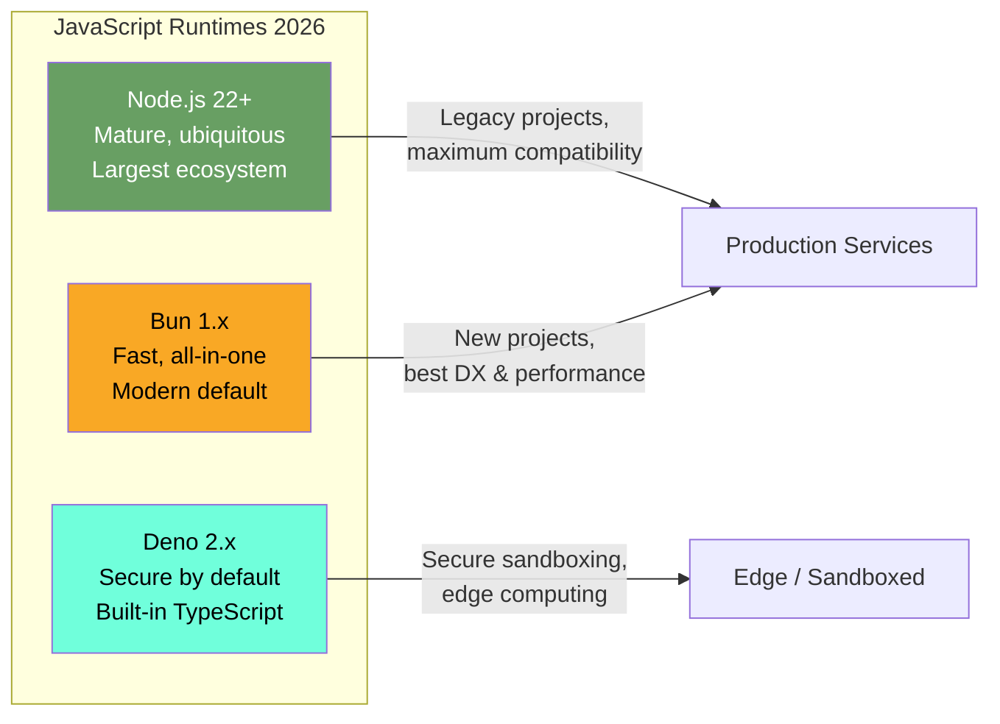
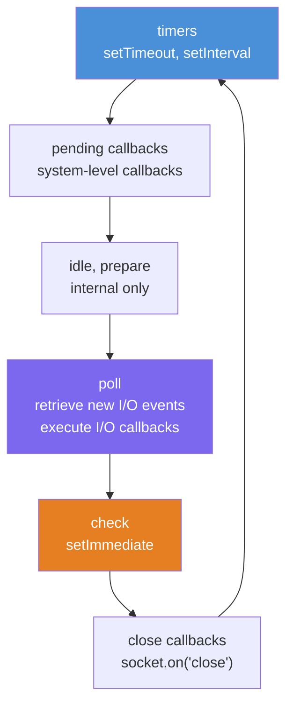
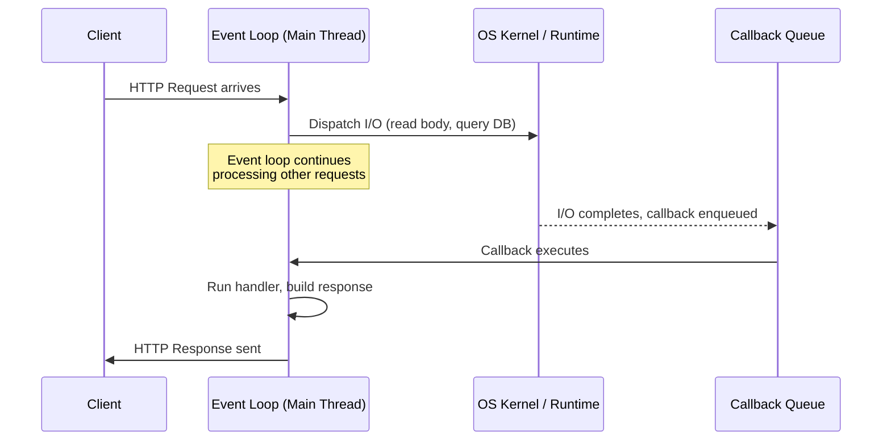
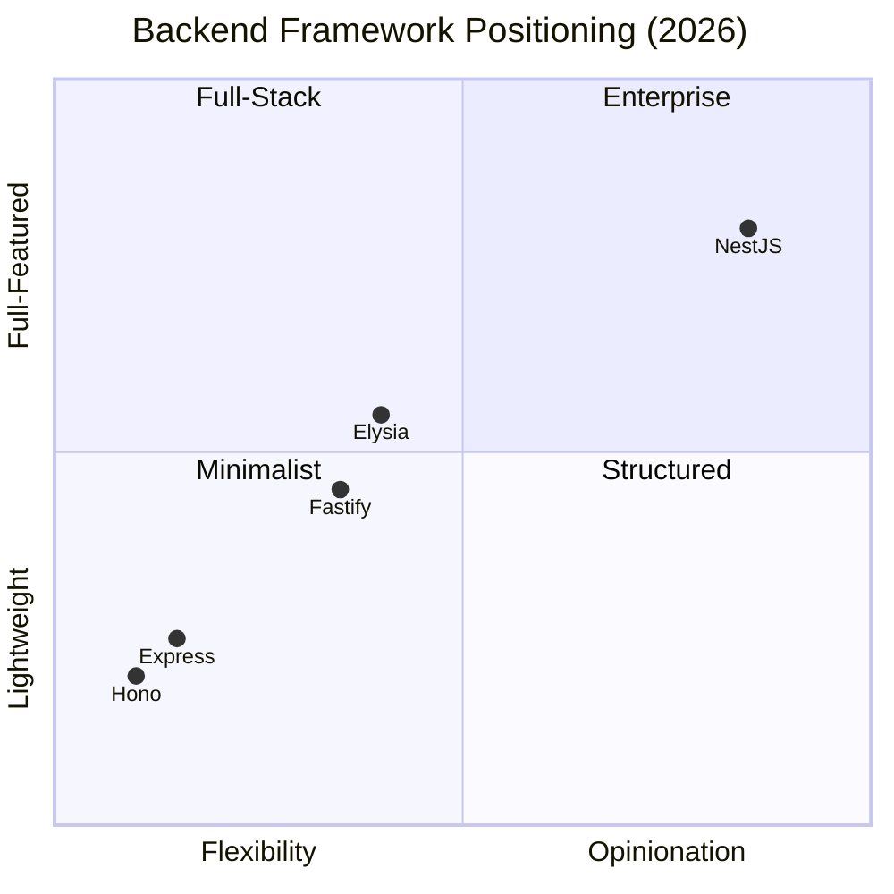

# JavaScript & TypeScript Backend Fundamentals

> **Learning Path:** Backend Engineering with JavaScript/TypeScript — Bun + Elysia/Hono
> **Level:** Entry / Mid / Senior
> **Updated:** June 2026

A practical, opinionated guide to building production backend systems with JavaScript and TypeScript in 2026. This document covers the runtime model, the type system, the module ecosystem, the framework landscape, and the decision-making framework you need to choose the right tools for the job.

The JavaScript backend ecosystem has matured beyond Node.js. In 2026, Bun is the modern runtime for new projects, Elysia provides end-to-end type safety on Bun, and Hono offers runtime portability across every edge and server platform. This guide teaches the fundamentals that apply across all JS/TS runtimes, with Bun + Elysia/Hono as the recommended stack.

---

## Table of Contents

1. [Why JavaScript/TypeScript for Backend in 2026](#1-why-javascripttypescript-for-backend-in-2026)
2. [The JS/TS Runtime Landscape](#2-the-jsts-runtime-landscape)
3. [The Event Loop Mental Model](#3-the-event-loop-mental-model)
4. [TypeScript: Why Types Matter for Backend](#4-typescript-why-types-matter-for-backend)
5. [Module System: ESM Everywhere](#5-module-system-esm-everywhere)
6. [Framework Landscape: Elysia, Hono, and Beyond](#6-framework-landscape-elysia-hono-and-beyond)
7. [Decision Framework: When JS/TS vs Others](#7-decision-framework-when-jsts-vs-others)
8. [Common Pitfalls](#8-common-pitfalls)
9. [What's Next](#9-whats-next)

---

## 1. Why JavaScript/TypeScript for Backend in 2026

`[Entry]`

JavaScript is not the fastest language. TypeScript is not the most expressive type system. But together, they form the most practical backend stack for a large class of workloads in 2026. Here is why.

### Event-Driven, Non-Blocking I/O

All modern JS runtimes (Node.js, Bun, Deno) were designed around one insight: most backend work is I/O, not computation. Reading from a database, writing to a queue, calling an external API, serving a file — these operations spend 99% of their time waiting. JS runtimes do not wait. They dispatch the operation and move on to the next request. When the I/O completes, a callback fires. This model handles thousands of concurrent connections with a single thread.

### JSON-Native

The web speaks JSON. JavaScript speaks JSON. There is no serialization impedance mismatch. Request bodies, response payloads, database documents, configuration files — JSON is everywhere, and `JSON.parse` / `JSON.stringify` are among the fastest implementations available because they are built into the engine.

### Type Safety at Scale with TypeScript

TypeScript is not about preventing bugs. It is about enabling change. When your types are correct and complete, refactoring is a mechanical operation, not an archaeological dig through 50 files. In 2026, TypeScript 5.x provides `satisfies`, `using`, isolated declarations, and decorator support — making backend code as maintainable as any statically-typed language.

### Unified Language Stack

One language from frontend to backend to edge functions to serverless. One type system shared across the entire application. One set of validation schemas (zod/valibot) used on both client and server. This is not a minor convenience — it is a significant reduction in cognitive overhead and a practical enabler for small teams.

### Who Uses JS/TS Backend in 2026

| Company | Stack | Scale |
|---------|-------|-------|
| Shopify | Node.js + Hono | Millions of merchants |
| Netflix | Node.js API gateway | 300M+ subscribers |
| Vercel | Node.js edge functions | Billions of requests/week |
| Supabase | Elysia + Bun (new services) | Fast-growing backend platform |
| Cal.com | Next.js + tRPC | Scheduling at scale |
| Ioredis/Upstash | Hono edge functions | Serverless Redis |

### When JS/TS is NOT the Right Choice

- **CPU-bound computation**: Image processing, video encoding, heavy ML inference. Use Go, Rust, or C++.
- **Ultra-low-latency systems**: High-frequency trading, real-time game physics. GC pauses and event loop overhead make sub-microsecond latency impossible.
- **Massive parallelism**: Systems that need to saturate 64+ cores with pure computation. Go or Erlang are better architectural fits.
- **Memory-constrained environments**: Embedded systems, IoT edge devices. The runtime overhead is too high.

---

## 2. The JS/TS Runtime Landscape

`[Entry]` `[Mid]`

In 2026, "JavaScript runtime" no longer means "Node.js." Three runtimes compete, each with distinct strengths.



### Node.js 22+ — The Incumbent

Node.js remains the most deployed JS runtime. It is mature, battle-tested, and has the largest ecosystem. Every cloud provider supports it natively. Every CI/CD tool has a Node.js image.

- **When to use**: Maintaining existing projects, deploying to environments that only support Node.js, working with Node.js-only packages.
- **Limitations**: No native TypeScript support (requires transpilation), fragmented tooling (npm/yarn/pnpm + separate bundler), slower than Bun for cold starts and package management.

### Bun 1.x — The Modern Default for New Projects

Bun is the recommended runtime for new JS/TS backend projects in 2026. It provides:

- **Native TypeScript execution**: No build step. `bun run index.ts` just works.
- **Built-in package manager**: 3-5x faster than npm/pnpm. Replaces npm, npx, and package manager scripts.
- **Built-in test runner**: Compatible with Jest assertions. No Vitest/Jest dependency needed.
- **Built-in bundler**: `Bun.build()` for creating standalone executables.
- **Built-in SQLite**: `bun:sqlite` for embedded database needs.
- **Native ESM**: No CommonJS baggage. ESM from day one.
- **Web standard APIs**: `fetch`, `WebSocket`, `ReadableStream`, `Request`, `Response` — built-in, no polyfills.
- **Fast cold starts**: 2-4x faster than Node.js. Matters for serverless and edge.

```typescript
// No build step needed. Just run:
// bun run src/index.ts

const server = Bun.serve({
  port: 3000,
  fetch(req) {
    return new Response("Hello from Bun!", { status: 200 });
  },
});

console.log(`Listening on ${server.url}`);
```

- **When to use**: New projects, performance-sensitive services, developer experience matters, you want an all-in-one toolchain.
- **Limitations**: Smaller ecosystem than Node.js (but growing fast), some Node.js APIs not yet fully compatible, Windows support improving but not at parity.

### Deno 2.x — The Secure Alternative

Deno provides a secure-by-default sandbox model, native TypeScript, and a curated standard library. In 2026, Deno 2.x added full npm compatibility, making it a viable option for backend development.

- **When to use**: Security-sensitive environments, content execution sandboxes, teams that prefer a curated standard library over npm freedom.
- **Limitations**: Smaller community than Node.js/Bun, some npm packages still have compatibility issues.

### Runtime Comparison

| Feature | Bun 1.x | Node.js 22+ | Deno 2.x |
|---------|---------|-------------|----------|
| TypeScript | Native | Requires build step | Native |
| Package manager | Built-in (fast) | External (npm/pnpm) | Built-in |
| Test runner | Built-in | External (Vitest/Jest) | Built-in |
| Cold start | ~10ms | ~50ms | ~30ms |
| ESM support | Native | Via config | Native |
| npm compatibility | Most packages | Full | Full (Deno 2.x) |
| Web standard APIs | Built-in | Partial (experimental) | Built-in |
| Windows support | Good | Full | Good |
| Production maturity | Growing (2024+) | 15+ years | Growing (2023+) |

---

## 3. The Event Loop Mental Model

`[Entry]` `[Mid]`

Regardless of which runtime you use, the fundamental execution model is the same: single-threaded JavaScript execution with an event loop for async I/O. If you do not understand this, you will write code that looks correct but fails under load.

### The Event Loop Phases

The event loop is not a queue. It is a cycle with distinct phases, each with its own queue:



| Phase | What Runs | Key APIs |
|-------|-----------|----------|
| **timers** | Expired `setTimeout` and `setInterval` callbacks | `setTimeout`, `setInterval` |
| **pending callbacks** | Deferred system callbacks (TCP errors, DNS lookup results) | Internal |
| **idle, prepare** | Internal housekeeping | Internal |
| **poll** | I/O callbacks for completed operations | `fs`, `net`, `http` callbacks |
| **check** | `setImmediate` callbacks | `setImmediate` |
| **close callbacks** | Resource cleanup callbacks | `socket.on('close')` |

### Microtasks vs Macrotasks

Between each phase, the runtime checks two microtask queues:

1. **nextTick queue**: `process.nextTick()` callbacks (Node.js only, runs first always).
2. **Promise microtask queue**: Resolved `.then()` / `.catch()` / `await` continuations.

```typescript
console.log("1: sync");

setTimeout(() => console.log("2: setTimeout (macrotask)"), 0);

Promise.resolve().then(() => console.log("3: promise (microtask)"));

console.log("4: sync");

// Output:
// 1: sync
// 4: sync
// 3: promise (microtask)
// 2: setTimeout (macrotask)
```

`[Senior]` Bun processes microtasks differently from Node.js. In Bun, microtasks are drained more aggressively between phases, which can change the ordering of interleaved microtask/macrotask code. If you are migrating from Node.js, test async ordering carefully.

### Single-Threaded: What It Really Means

- **Your JavaScript code** runs on one thread. At any given moment, only one function is executing.
- **The event loop** is single-threaded. It cycles through phases, running one callback at a time.
- **I/O operations** are handled by the operating system kernel and/or thread pool — these are not blocking your JS thread.

### Request Handling Flow



### When This Model Shines vs Struggles

**Shines**: API servers (routing, validating, querying, serializing), real-time (WebSocket, SSE, streaming), microservices (fast startup, small footprint), BFF (aggregating downstream services).

**Struggles**: CPU-heavy computation (sorts, image processing, heavy algorithms), long synchronous computations (>10ms blocks other connections), shared-state parallelism.

For CPU work, use worker threads (Node.js) or Bun's built-in worker support:

```typescript
// Bun worker example
const worker = new Worker(new URL("./heavy-compute.ts", import.meta.url));
worker.postMessage({ data: largeArray });
worker.onmessage = (e) => {
  console.log("Result:", e.data);
};
```

---

## 4. TypeScript: Why Types Matter for Backend

`[Entry]` `[Mid]`

TypeScript is not optional for backend development in 2026. The question is not "should I use TypeScript?" but "how well am I using it?"

### What TypeScript Actually Gives You

1. **Compile-time error detection**: Typos, wrong argument types, missing properties — caught before the code runs.
2. **Refactoring safety**: Rename a field, change a function signature, move a module — the compiler finds every call site that breaks.
3. **Self-documenting code**: Types are a contract. `getUser(id: string): Promise<User>` tells you everything you need to know.
4. **IDE productivity**: Autocomplete, inline documentation, go-to-definition, find-all-references — powered by the type system.
5. **End-to-end type safety**: With Elysia, your route validation schema, handler types, and response types are derived from a single source of truth.

### TypeScript 5.x in 2026

- **`satisfies` operator** (5.0): Type-check a value without widening its type. Essential for config objects.
- **`using` keyword** (5.2): Resource management with `Symbol.dispose`. Database connections, file handles — automatic cleanup.
- **Decorators** (5.0): Standard ECMAScript decorators, stable and usable.
- **Isolated declarations** (5.5): Enables parallel type-checking across packages in monorepos.

### Before and After: Untyped vs Typed API Handler

Before — untyped JavaScript:

```javascript
export async function createUser(req, res) {
  const { name, email, role } = req.body;
  if (!name || !email) {
    return res.status(400).json({ error: "name and email required" });
  }
  const user = await db.users.create({
    data: { name, email, role: role || "viewer" },
  });
  res.status(201).json(user);
}
```

Problems: no validation on types, `role` accepts any string, response shape unknown, typos are silent failures.

After — typed with Elysia (end-to-end type safety):

```typescript
import { Elysia, t } from "elysia";

const app = new Elysia()
  .post(
    "/users",
    async ({ body, set }) => {
      const user = await db.users.create({ data: body });
      set.status = 201;
      return user;
    },
    {
      body: t.Object({
        name: t.String({ minLength: 1, maxLength: 200 }),
        email: t.String({ format: "email" }),
        role: t.Union(["admin", "editor", "viewer"], { default: "viewer" }),
      }),
      response: t.Object({
        id: t.String(),
        name: t.String(),
        email: t.String(),
        role: t.String(),
        createdAt: t.String(),
      }),
    }
  );
```

`[Senior]` With Elysia, the `body` type is inferred from the schema automatically. The handler's `body` parameter is fully typed — no manual type assertion needed. The `response` schema validates the output at runtime while providing compile-time types. This is end-to-end type safety: one schema, runtime validation + compile-time types.

---

## 5. Module System: ESM Everywhere

`[Entry]` `[Mid]`

In 2026, ESM (ECMAScript Modules) is the standard. CommonJS is legacy. Bun runs ESM natively with no configuration.

### ESM vs CommonJS

| Feature | ESM | CommonJS |
|---------|-----|----------|
| Syntax | `import` / `export` | `require()` / `module.exports` |
| Loading | Asynchronous, static analysis | Synchronous, dynamic |
| Tree-shaking | Supported | Not possible |
| Top-level await | Supported | Not supported |
| Standard | ECMAScript specification | Node.js-specific convention |

### Bun Makes This Simple

Bun runs ESM by default. No `"type": "module"` needed. No tsconfig module resolution headaches. No `.mjs` extensions.

```jsonc
// package.json — Bun project
{
  "name": "my-backend",
  "scripts": {
    "dev": "bun run --watch src/index.ts",
    "test": "bun test",
    "start": "bun run src/index.ts"
  }
}
```

```typescript
// src/index.ts — just works, no build step
import { Elysia } from "elysia";

const app = new Elysia()
  .get("/health", () => ({ status: "ok" }))
  .listen(3000);

console.log(`Listening on ${app.server!.url}`);
```

`[Senior]` Bun resolves TypeScript imports without extensions (unlike Node.js with `NodeNext` resolution). This means `import { foo } from "./foo"` works without the `.js` extension hack required in Node.js ESM. Bun resolves `.ts`, `.tsx`, `.js`, `.jsx` automatically.

---

## 6. Framework Landscape: Elysia, Hono, and Beyond

`[Mid]` `[Senior]`

The framework you choose determines your project's architecture, performance ceiling, and developer experience. In 2026, the landscape has shifted from Express/Fastify to Bun-native and edge-first frameworks.

### Framework Comparison



| Framework | Runtime | Type Safety | Performance | Best For |
|-----------|---------|-------------|-------------|----------|
| **Elysia** | Bun only | End-to-end (schema → handler → response) | Very High | New Bun projects, maximum type safety |
| **Hono** | Any (Bun, Node, Deno, Edge) | Strong (zod/valibot integration) | Very High | Multi-runtime, edge, serverless |
| **Fastify** | Node.js | Good (JSON Schema based) | High | Node.js production APIs |
| **Express** | Node.js | Weak (via @types) | Moderate | Legacy projects, quick prototypes |
| **NestJS** | Node.js / Bun | Strong (decorators) | Moderate | Enterprise, large teams |

### Elysia — The Bun-Native Framework

Elysia is the recommended framework for new Bun backend projects. It provides end-to-end type safety: your validation schema, route handler, and response type are derived from a single schema definition.

```typescript
import { Elysia, t } from "elysia";
import { swagger } from "@elysiajs/swagger";

const app = new Elysia()
  .use(swagger())
  .group("/api", (app) =>
    app
      .get("/users/:id", async ({ params: { id } }) => {
        return await getUser(id);
      }, {
        params: t.Object({ id: t.String() }),
        response: t.Object({
          id: t.String(),
          name: t.String(),
          email: t.String(),
        }),
      })
      .post("/users", async ({ body, set }) => {
        const user = await createUser(body);
        set.status = 201;
        return user;
      }, {
        body: t.Object({
          name: t.String({ minLength: 1 }),
          email: t.String({ format: "email" }),
        }),
      })
  )
  .listen(3000);
```

Key features:
- **End-to-end type safety**: Schema → handler → response, one source of truth
- **Built-in Swagger**: `@elysiajs/swagger` generates docs from your schemas
- **Plugin system**: Composable middleware via `.use()`
- **WebSocket support**: Built-in, first-class
- **Lifecycle hooks**: `onRequest`, `beforeHandle`, `afterHandle`, `onError`
- **Performance**: One of the fastest frameworks on any runtime

### Hono — The Universal Framework

Hono runs everywhere: Bun, Node.js, Deno, Cloudflare Workers, AWS Lambda, Vercel Edge, Fastly. It is the right choice when you need runtime portability or are deploying to edge platforms.

```typescript
import { Hono } from "hono";
import { zValidator } from "@hono/zod-validator";
import { z } from "zod";

const app = new Hono();

const CreateUserSchema = z.object({
  name: z.string().min(1),
  email: z.string().email(),
});

app.post("/users", zValidator("json", CreateUserSchema), async (c) => {
  const body = c.req.valid("json");
  const user = await createUser(body);
  return c.json(user, 201);
});

export default app;
```

Key features:
- **Multi-runtime**: Write once, deploy anywhere
- **Lightweight**: Minimal overhead, fast cold starts
- **Middleware ecosystem**: RPC helpers, validators, auth, logging
- **Type-safe RPC**: `@hono/zod-openapi` for end-to-end types across client/server

### When to Choose Which

| Scenario | Framework | Why |
|----------|-----------|-----|
| New Bun backend project | Elysia | Best DX on Bun, end-to-end type safety |
| Edge / serverless deployment | Hono | Runtime portability, small bundle |
| Existing Node.js project | Fastify | Performance upgrade from Express |
| Large enterprise team | NestJS | Enforced structure, DI, Angular patterns |
| Quick prototype / hackathon | Hono or Elysia | Fast setup, minimal boilerplate |
| API that runs on multiple platforms | Hono | Same code on Bun, Node, Deno, Edge |

### Recommendation for This Learning Path

**Elysia for Bun-native projects.** Hono for multi-runtime/edge projects. Both provide excellent TypeScript support. Both are production-ready in 2026.

---

## 7. Decision Framework: When JS/TS vs Others

`[Mid]` `[Senior]`

JavaScript/TypeScript is a tool, not a religion. Use it when it fits, reach for something else when it does not.

### vs Go

| Dimension | JS/TS (Bun) | Go |
|-----------|-------------|-----|
| Concurrency model | Event loop, single-threaded | Goroutines, multi-threaded |
| CPU-bound work | Worker threads (awkward) | Native (goroutines) |
| Startup time | ~10ms (Bun) | ~1-5ms |
| Memory footprint | ~15-30MB (Bun) | ~5-10MB |
| Learning curve | Low (if you know JS) | Medium (new language) |
| Type safety | TypeScript (optional) | Built-in (mandatory) |

**Choose Go when**: high CPU utilization, low memory, infrastructure services (proxies, load balancers, message brokers).

**Choose JS/TS when**: I/O-heavy workloads, unified frontend/backend stack, rapid iteration matters.

### vs Python

| Dimension | JS/TS (Bun) | Python |
|-----------|-------------|--------|
| Async support | Native (event loop) | `asyncio` (bolted on) |
| Performance | 2-5x faster (JIT) | Slower (interpreted) |
| Data / ML ecosystem | Limited | Unmatched |
| Type safety | TypeScript (mature) | Type hints (optional) |

**Choose Python when**: data science, ML/AI, scientific computing.

**Choose JS/TS when**: web APIs, real-time services, full-stack applications.

### vs Java

| Dimension | JS/TS (Bun) | Java |
|-----------|-------------|------|
| Startup time | ~10ms | ~2-5s (JVM) |
| Peak throughput | Moderate | Very high (after JIT) |
| Memory | ~15-30MB | ~200-500MB (JVM) |
| Ecosystem maturity | Good | Exceptional (25+ years) |
| Verbosity | Low | High |

**Choose Java when**: JVM ecosystem (Kafka, Hadoop, enterprise), peak throughput after warmup, deep Java org expertise.

**Choose JS/TS when**: fast startup (serverless, containers), lower memory, TypeScript over Java verbosity.

### vs Rust

| Dimension | JS/TS (Bun) | Rust |
|-----------|-------------|------|
| Performance | Moderate | Exceptional |
| Memory safety | GC-managed | Compile-time guaranteed |
| Development speed | Fast | Slow (compile times, learning curve) |
| Hiring pool | Large | Small |

**Choose Rust when**: zero-cost abstractions, deterministic latency, performance-critical infrastructure.

**Choose JS/TS when**: developer productivity matters more than raw performance.

---

## 8. Common Pitfalls

`[Entry]` `[Mid]` `[Senior]`

### Blocking the Event Loop

The number one cause of production incidents in JS backends. The rule: never use synchronous APIs in request handlers.

```typescript
// BAD
import { readFileSync } from "fs";
const data = readFileSync("./large-file.json", "utf-8");

// GOOD
import { readFile } from "fs/promises";
const data = await readFile("./large-file.json", "utf-8");

// BEST with Bun
const file = Bun.file("./large-file.json");
const data = await file.json();
```

### Treating TypeScript as "Optional Types"

TypeScript is not a linter you can ignore. In backend code, every function parameter, every return type, every API boundary should be typed. Use `strict: true`. Use `unknown` instead of `any`. Use schema validation at boundaries.

### Mixing ESM and CommonJS

Bun handles this transparently, but if you deploy to Node.js, mixing module systems causes subtle bugs. Standardize on ESM. Use `createRequire()` only for legacy CJS packages.

### Memory Leaks in Long-Running Servers

Common causes: closures retaining large objects, unbounded caches, event listeners not removed.

```typescript
// BAD: Growing cache with no limit
const cache = new Map<string, UserData>();

// GOOD: Bounded cache with TTL
import { LRUCache } from "lru-cache";
const cache = new LRUCache<string, UserData>({
  max: 1000,
  ttl: 1000 * 60 * 5,
});
```

### Ignoring Bun-Specific Behaviors

Bun is not a drop-in Node.js replacement in all cases:
- `process.nextTick` behaves differently
- Some native Node.js modules are not available
- Hot reload (`--watch`) resets module state
- Test runner assertions differ slightly from Jest

Always test on your target runtime. Do not develop on Bun and deploy to Node.js without testing.

---

## 9. What's Next

This document covers the fundamentals. The learning path continues with hands-on modules:

| Module | Topic | Level |
|--------|-------|-------|
| 01 | Project Setup: Bun, TypeScript, and Tooling | `[Entry]` |
| 02 | Building a REST API with Elysia | `[Entry]` |
| 03 | Building a REST API with Hono | `[Entry]` |
| 04 | Database Access with Drizzle ORM | `[Mid]` |
| 05 | Authentication and Authorization | `[Mid]` |
| 06 | Testing Strategies with Bun Test | `[Mid]` |
| 07 | Error Handling and Observability | `[Mid]` |
| 08 | Real-Time Communication (WebSocket) | `[Mid]` |
| 09 | Performance Optimization | `[Senior]` |
| 10 | Deployment and Production Readiness | `[Senior]` |

Each module includes a working code example, exercises, and further reading.

---

## Further Reading

- [Bun Documentation](https://bun.sh/docs) — The official Bun reference.
- [Elysia Documentation](https://elysiajs.com/) — Framework docs with type-safe examples.
- [Hono Documentation](https://hono.dev/) — Multi-runtime framework guide.
- [TypeScript Handbook](https://www.typescriptlang.org/docs/handbook/) — Official TypeScript guide.
- [JavaScript Event Loop Deep Dive](https://nodejs.org/en/learn/asynchronous-work/event-loop-timers-and-nexttick) — Node.js docs (concepts apply to all runtimes).

---

*This guide is part of the TP-Coder Innovation Hub learning paths. Contributions welcome.*
