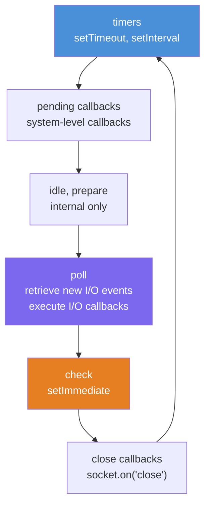
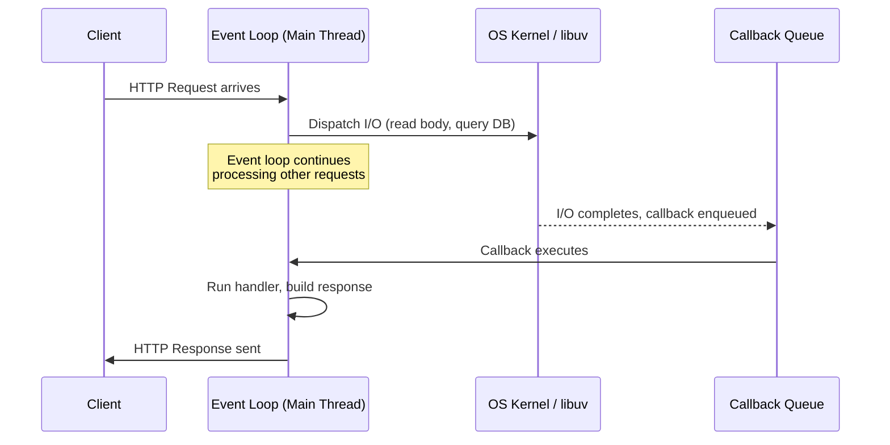

# Node.js & TypeScript Backend Fundamentals

> **Learning Path:** Backend Engineering with Node.js & TypeScript
> **Level:** Entry / Mid / Senior
> **Updated:** June 2026

A practical, opinionated guide to building production backend systems with Node.js and TypeScript. This document covers the runtime model, the type system, the module ecosystem, the framework landscape, and the decision-making framework you need to choose the right tools for the job.

---

## Table of Contents

1. [Why Node.js for Backend in 2026](#1-why-nodejs-for-backend-in-2026)
2. [The Node.js Runtime Mental Model](#2-the-nodejs-runtime-mental-model)
3. [Single-Threaded Concurrency: What It Really Means](#3-single-threaded-concurrency-what-it-really-means)
4. [TypeScript: Why Types Matter for Backend](#4-typescript-why-types-matter-for-backend)
5. [Module System: ESM is the Future](#5-module-system-esm-is-the-future)
6. [Framework Landscape](#6-framework-landscape)
7. [Decision Framework: When Node.js vs Others](#7-decision-framework-when-nodejs-vs-others)
8. [Common Pitfalls](#8-common-pitfalls)
9. [What's Next](#9-whats-next)

---

## 1. Why Node.js for Backend in 2026

`[Entry]`

Node.js is not the newest runtime, and it is not the fastest. It is, however, the most practical choice for a large class of backend workloads in 2026. Here is why.

### Event-Driven, Non-Blocking I/O

Node.js was designed around a single insight: most backend work is I/O, not computation. Reading from a database, writing to a queue, calling an external API, serving a file -- these operations spend 99% of their time waiting. Node.js does not wait. It dispatches the operation and moves on to the next request. When the I/O completes, a callback fires. This model handles thousands of concurrent connections with a single thread.

### JSON-Native

The web speaks JSON. Node.js speaks JSON. There is no serialization impedance mismatch. Request bodies, response payloads, database documents, configuration files -- JSON is everywhere, and JavaScript's `JSON.parse` / `JSON.stringify` are among the fastest implementations available because they are built into V8.

### Real-Time and Streaming

WebSockets, Server-Sent Events, HTTP/2 push, gRPC streaming -- Node.js handles all of these natively and well. The event-driven model maps directly to stream-oriented protocols. This is why real-time applications (chat, collaboration tools, live dashboards, gaming backends) are a natural fit.

### Who Uses It

| Company | Use Case | Scale |
|---------|----------|-------|
| Netflix | API gateway, server-side rendering | 200M+ subscribers |
| PayPal | Payment processing, identity services | Billions in transactions |
| Uber | Real-time dispatch, geospatial matching | Millions of trips/day |
| LinkedIn | API layer, mobile backend | 900M+ members |
| Medium | Content serving, recommendation engine | 100M+ readers |
| Shopify | E-commerce platform, checkout | Millions of merchants |

These companies do not use Node.js because it is trendy. They use it because it solves a specific problem well: high-concurrency I/O with a unified language stack (JavaScript/TypeScript from frontend to backend).

### When Node.js is NOT the Right Choice

Node.js is a poor fit for:
- **CPU-bound computation**: Image processing, video encoding, heavy ML inference. Use worker threads, or better, a language designed for it (Go, Rust, C++).
- **Ultra-low-latency systems**: High-frequency trading, real-time game physics. The garbage collector pauses and event loop overhead make sub-microsecond latency impossible.
- **Massive parallelism**: Systems that need to saturate 64+ cores with pure computation. Go or Erlang are better architectural fits.

---

## 2. The Node.js Runtime Mental Model

`[Entry]` `[Mid]`

If you do not understand the runtime, you will write code that looks correct but fails under load. This section is mandatory.

### V8, libuv, and the C++ Bridge

Node.js is three things stacked together:

1. **V8**: Google's JavaScript engine. Compiles JS to machine code, manages memory, runs the garbage collector.
2. **libuv**: A C library that provides the event loop, thread pool, and async I/O abstraction across operating systems.
3. **Node.js C++ bindings**: The glue that exposes libuv's async operations (file system, network, DNS, etc.) to JavaScript as non-blocking APIs.

When you call `fs.readFile()`, JavaScript does not read the file. V8 calls into the C++ binding, which delegates to libuv, which submits the work to the operating system (or its own thread pool). When the operation completes, libuv signals the event loop, which eventually runs your callback.

### The Event Loop Phases

The event loop is not a queue. It is a cycle with distinct phases, each with its own queue:



| Phase | What Runs | Key APIs |
|-------|-----------|----------|
| **timers** | Expired `setTimeout` and `setInterval` callbacks | `setTimeout`, `setInterval` |
| **pending callbacks** | Deferred system callbacks (TCP errors, DNS lookup results) | Internal |
| **idle, prepare** | Internal libuv housekeeping | Internal |
| **poll** | I/O callbacks for completed operations (file reads, network data, etc.) | `fs`, `net`, `http` callbacks |
| **check** | `setImmediate` callbacks | `setImmediate` |
| **close callbacks** | Resource cleanup callbacks | `socket.on('close')` |

Between each phase, and between each callback within a phase, the runtime checks two microtask queues:

1. **nextTick queue**: `process.nextTick()` callbacks. These run first, always.
2. **Promise microtask queue**: Resolved `.then()` / `.catch()` / `await` continuations.

### Microtasks vs Macrotasks

```
Execution order:

1. Synchronous code runs to completion
2. nextTick microtasks drain completely
3. Promise microtasks drain completely
4. One macrotask (event loop phase callback) runs
5. Go to step 2
```

```typescript
console.log("1: sync");

setTimeout(() => console.log("2: setTimeout (macrotask)"), 0);

Promise.resolve().then(() => console.log("3: promise (microtask)"));

process.nextTick(() => console.log("4: nextTick (microtask)"));

console.log("5: sync");

// Output:
// 1: sync
// 5: sync
// 4: nextTick (microtask)
// 3: promise (microtask)
// 2: setTimeout (macrotask)
```

`[Senior]` The practical implication: `process.nextTick` can starve the event loop if you recursively call it, because it runs before every phase. Promise microtasks can also starve the loop in a `while` loop with `await`. This is not theoretical -- it causes real latency spikes in production.

### The libuv Thread Pool

Some operations cannot be made async by the operating system (file system operations on most platforms, DNS lookup on some). libuv maintains a default thread pool of **4 threads** (configurable via `UV_THREADPOOL_SIZE`, max 1024) for these operations.

When all 4 threads are busy, subsequent file system requests queue. This is why heavy file I/O can unexpectedly block your "async" server: the thread pool is a bottleneck you did not know you had.

```typescript
import { setMaxListeners } from "events";

// Set thread pool size before any I/O (must be set early)
process.env.UV_THREADPOOL_SIZE = "8";
```

---

## 3. Single-Threaded Concurrency: What It Really Means

`[Entry]` `[Mid]`

The most misunderstood statement in Node.js: "Node.js is single-threaded." Let's be precise.

### What Is Single-Threaded

- **Your JavaScript code** runs on one thread. One. At any given moment, only one function is executing.
- **The event loop** is single-threaded. It cycles through phases, running one callback at a time.
- **V8's garbage collector** runs on the same thread (with occasional parallel GC in newer versions, but the stop-the-world pauses still happen on your thread).

### What Is NOT Single-Threaded

- **Kernel I/O operations**: Network requests, filesystem operations -- these are handled by the operating system kernel, which uses its own threads and interrupt handlers.
- **libuv thread pool**: File system operations, DNS lookups, compression -- these run on libuv's thread pool (default 4 threads).
- **Worker threads**: You can spawn separate threads with `worker_threads`, each with its own V8 isolate and event loop.

### Request Handling Flow



### When Node.js Shines

- **API servers**: Routing requests, validating input, querying databases, serializing JSON. This is 90% of most backend workloads.
- **Real-time applications**: WebSocket servers, streaming APIs, pub/sub systems. The event loop is a natural fit for connection multiplexing.
- **Microservices**: Fast startup (compared to JVM), small memory footprint, lightweight concurrency. Node.js services start in under 100ms.
- **BFF (Backend for Frontend)**: Aggregating multiple downstream services, transforming data, serving frontend-specific APIs.

### When Node.js Struggles

- **CPU-heavy computation**: Sorting millions of rows, running complex algorithms, image/video processing. The event loop blocks.
- **Long-running calculations**: Any synchronous computation over ~10ms will cause noticeable latency for other connections.
- **Shared-state parallelism**: If you need true shared-memory parallel computation, Node.js worker threads have structured cloning overhead that makes shared state awkward (SharedArrayBuffer exists but is complex).

### Worker Threads for CPU Work

```typescript
import { Worker } from "worker_threads";

function runInWorker<T>(filename: string, data: unknown): Promise<T> {
  return new Promise((resolve, reject) => {
    const worker = new Worker(filename, {
      workerData: data,
    });
    worker.on("message", resolve);
    worker.on("error", reject);
    worker.on("exit", (code) => {
      if (code !== 0) reject(new Error(`Worker exited with code ${code}`));
    });
  });
}

// Main thread
const result = await runInWorker<number>(
  new URL("./heavy-compute.worker.ts", import.meta.url).href,
  { dataset: largeArray }
);
```

`[Senior]` Note the `URL` constructor for the worker path. In ESM, relative paths for workers must be resolved as file URLs. The `"./heavy-compute.worker.ts"` path alone will not work with `type: "module"`.

---

## 4. TypeScript: Why Types Matter for Backend

`[Entry]` `[Mid]`

TypeScript is not about preventing bugs. It is about enabling change. When your types are correct and complete, refactoring is a mechanical operation, not an archaeological dig through 50 files.

### What TypeScript Actually Gives You

1. **Compile-time error detection**: Typos, wrong argument types, missing properties -- caught before the code runs.
2. **Refactoring safety**: Rename a field, change a function signature, move a module -- the compiler finds every call site that breaks.
3. **Self-documenting code**: Types are a contract. `getUser(id: string): Promise<User>` tells you everything you need to know. No JSDoc required.
4. **IDE productivity**: Autocomplete, inline documentation, go-to-definition, find-all-references. These features are powered by the type system.

### TypeScript 5.x in 2026

TypeScript 5.x has matured significantly. Key features relevant to backend development:

- **`satisfies` operator** (5.0): Type-check a value without widening its type. Essential for config objects.
- **`using` keyword** (5.2): Resource management with `Symbol.dispose`. Database connections, file handles -- automatic cleanup.
- **Decorators** (5.0): Standard ECMAScript decorators, stable and usable with NestJS and similar frameworks.
- **`--moduleResolution bundler`** (5.0): The correct setting for backend TypeScript that runs through a bundler or Node.js directly.
- **`--verbatimModuleSyntax`** (5.0): Explicit control over import/export emission. Replaces `importsNotUsedAsValues` and `preserveValueImports`.
- **Isolated declarations** (5.5): Enables parallel type-checking across packages in monorepos.

### Before and After: Untyped vs Typed API Handler

Before -- untyped JavaScript:

```javascript
// handlers.js
export async function createUser(req, res) {
  const { name, email, role } = req.body;

  if (!name || !email) {
    return res.status(400).json({ error: "name and email required" });
  }

  const user = await db.users.create({
    data: { name, email, role: role || "viewer" },
  });

  res.status(201).json(user);
}
```

Problems:
- No validation on `name` type (could be a number, array, null).
- `role` accepts any string, not just the allowed values.
- `db.users.create` arguments are untyped -- typos in field names are silent failures.
- Response shape is unknown -- frontend developers guess.

After -- typed TypeScript:

```typescript
import type { FastifyRequest, FastifyReply } from "fastify";
import { z } from "zod";

const CreateUserSchema = z.object({
  name: z.string().min(1).max(200),
  email: z.string().email(),
  role: z.enum(["admin", "editor", "viewer"]).default("viewer"),
});

type CreateUserInput = z.infer<typeof CreateUserSchema>;

interface UserResponse {
  id: string;
  name: string;
  email: string;
  role: "admin" | "editor" | "viewer";
  createdAt: string;
}

async function createUser(
  req: FastifyRequest<{ Body: CreateUserInput }>,
  reply: FastifyReply
): Promise<void> {
  const parsed = CreateUserSchema.safeParse(req.body);
  if (!parsed.success) {
    reply.status(400).json({ errors: parsed.error.flatten() });
    return;
  }

  const user = await req.server.db.users.create({
    data: parsed.data,
  });

  reply.status(201).json(user satisfies UserResponse);
}

export { createUser, CreateUserSchema };
```

`[Senior]` The `satisfies` operator on the response ensures the returned object matches `UserResponse` without widening the type. If `db.users.create` returns extra fields (like a password hash), `satisfies` will flag the discrepancy.

---

## 5. Module System: ESM is the Future

`[Entry]` `[Mid]`

The JavaScript module ecosystem has been a source of confusion for a decade. In 2026, the dust has settled. ESM (ECMAScript Modules) is the standard. CommonJS is legacy. Here is the migration reality.

### ESM vs CommonJS

| Feature | ESM | CommonJS |
|---------|-----|----------|
| Syntax | `import` / `export` | `require()` / `module.exports` |
| Loading | Asynchronous, static analysis | Synchronous, dynamic |
| Tree-shaking | Supported (static imports) | Not possible |
| Top-level await | Supported | Not supported |
| `__dirname` / `__filename` | Not available (use `import.meta.url`) | Available |
| Circular dependencies | Handled via live bindings | Handled via partial exports |
| Standard | ECMAScript specification | Node.js-specific convention |

### Enabling ESM in Node.js

```jsonc
// package.json
{
  "name": "my-backend",
  "type": "module",
  "engines": {
    "node": ">=22.0.0"
  }
}
```

Setting `"type": "module"` tells Node.js to treat `.js` files as ESM. No `.mjs` extension needed.

### TypeScript Configuration for ESM

```jsonc
// tsconfig.json
{
  "compilerOptions": {
    "target": "ES2024",
    "module": "NodeNext",
    "moduleResolution": "NodeNext",
    "outDir": "./dist",
    "rootDir": "./src",
    "strict": true,
    "esModuleInterop": true,
    "skipLibCheck": true,
    "declaration": true,
    "sourceMap": true
  },
  "include": ["src/**/*"],
  "exclude": ["node_modules", "dist"]
}
```

Key points:
- `module: "NodeNext"` is the correct setting for Node.js ESM in 2026. Not `"ESNext"`. Not `"CommonJS"`.
- `moduleResolution: "NodeNext"` enables proper resolution of ESM imports with extensions.
- You must include file extensions in imports: `import { foo } from "./foo.js"` (even though the source file is `foo.ts`).

### The Migration Reality

Most of the npm ecosystem now supports ESM. The packages that do not are typically abandoned or maintained by authors who have opted out. In 2026:

- **New projects**: Use ESM exclusively. No question.
- **Existing projects**: Migrate incrementally. Start with `"type": "module"` in package.json, then convert files one at a time.
- **Dependencies stuck on CJS**: Use `createRequire()` to import them, or find an ESM-compatible alternative.

```typescript
// For importing a CJS-only package in ESM
import { createRequire } from "module";
const require = createRequire(import.meta.url);
const legacyPackage = require("legacy-cjs-package");
```

### Bun as an Alternative Runtime

Bun has matured into a viable alternative to Node.js for backend development. It provides:
- **Native TypeScript execution** (no build step)
- **Built-in package manager** (faster than npm/pnpm)
- **Built-in test runner** (compatible with Vitest assertions)
- **Built-in SQLite client** (`bun:sqlite`)
- **Native ESM support** (no CommonJS baggage)

Bun is worth evaluating for new projects, but Node.js remains the production default due to ecosystem maturity and deployment ubiquity.

---

## 6. Framework Landscape

`[Mid]` `[Senior]`

The framework you choose determines your project's architecture, performance ceiling, and developer experience. Here is the landscape in 2026.

### Framework Comparison


| Framework | Philosophy | Performance | TypeScript | Best For | Stars (2026) |
|-----------|-----------|-------------|------------|----------|--------------|
| **Express** | Minimal, unopinionated | Moderate | Via types (not native) | Quick prototypes, legacy codebases | 66k+ |
| **Fastify** | Fast, plugin-based | High | Native, first-class | Production APIs, performance-critical services | 33k+ |
| **Hono** | Ultra-light, edge-first | Very High | Native, first-class | Edge functions, serverless, microservices | 24k+ |
| **NestJS** | Enterprise, Angular-inspired | Moderate | Native, required | Large teams, complex domains, microservices | 70k+ |

### Express (Legacy / Ubiquitous)

Express is the jQuery of Node.js backends: everywhere, understood by everyone, but not the best choice for new projects in 2026.

```typescript
import express from "express";

const app = express();
app.use(express.json());

app.get("/health", (_req, res) => {
  res.json({ status: "ok" });
});

app.listen(3000);
```

Use it when: maintaining existing projects, working with teams that only know Express, building something that will be thrown away.

### Fastify (Performance)

Fastify is the recommended default for new Node.js backend projects in 2026. It is faster than Express (JSON serialization via `fast-json-stringify`, route-level schema validation), has a plugin system that actually works, and provides TypeScript types out of the box.

```typescript
import Fastify from "fastify";

const app = Fastify({ logger: true });

app.get("/health", async () => {
  return { status: "ok" };
});

app.post("/users", {
  schema: {
    body: {
      type: "object",
      required: ["name", "email"],
      properties: {
        name: { type: "string" },
        email: { type: "string", format: "email" },
      },
    },
  },
  handler: async (request, reply) => {
    const user = await createUser(request.body);
    reply.code(201).send(user);
  },
});

await app.listen({ port: 3000, host: "0.0.0.0" });
```

Use it when: building production APIs, performance matters, you want schema validation built-in.

### Hono (Edge / Worker)

Hono runs everywhere: Node.js, Bun, Deno, Cloudflare Workers, AWS Lambda, Vercel Edge. It is the lightest framework that still provides a full-featured routing layer.

```typescript
import { Hono } from "hono";

const app = new Hono();

app.get("/health", (c) => c.json({ status: "ok" }));

app.post("/users", async (c) => {
  const body = await c.req.json();
  const user = await createUser(body);
  return c.json(user, 201);
});

export default app;
```

Use it when: deploying to edge/serverless, building microservices, bundle size matters, you want runtime portability.

### NestJS (Enterprise / Opinionated)

NestJS provides a complete application framework: dependency injection, modules, decorators, guards, interceptors, and a prescribed project structure. It is the Spring Boot of the Node.js world.

Use it when: building large-scale enterprise applications, your team is familiar with Angular patterns, you need a structured architecture enforced by the framework.

### Recommendation Matrix

| Scenario | Recommended Framework |
|----------|----------------------|
| New production API | Fastify |
| Edge / serverless function | Hono |
| Enterprise monolith | NestJS |
| Quick prototype | Express or Hono |
| Real-time (WebSocket-heavy) | Fastify with `@fastify/websocket` |
| Microservice in a monorepo | Hono or Fastify |

---

## 7. Decision Framework: When Node.js vs Others

`[Mid]` `[Senior]`

Node.js is a tool, not a religion. Use it when it fits, reach for something else when it does not.

### vs Go

| Dimension | Node.js | Go |
|-----------|---------|-----|
| Concurrency model | Event loop, single-threaded | Goroutines, multi-threaded |
| CPU-bound work | Worker threads (awkward) | Native (goroutines) |
| Startup time | ~50-100ms | ~1-5ms |
| Memory footprint | ~30-50MB baseline | ~5-10MB baseline |
| Learning curve | Low (if you know JS) | Medium (new language) |
| Ecosystem | npm (largest package registry) | Go modules (smaller, higher quality) |

**Choose Go when**: you need high CPU utilization, low memory overhead, or you are building infrastructure services (proxies, load balancers, message brokers).

**Choose Node.js when**: your team already knows TypeScript, your workload is I/O-heavy, or you want a unified language across frontend and backend.

### vs Python

| Dimension | Node.js | Python |
|-----------|---------|--------|
| Async support | Native (event loop) | `asyncio` (bolted on) |
| Performance | 2-5x faster (V8 JIT) | Slower (interpreted) |
| Data / ML ecosystem | Limited | Unmatched (NumPy, PyTorch, pandas) |
| Type safety | TypeScript (mature) | Type hints (optional, less enforced) |
| Learning curve | Medium | Low |

**Choose Python when**: your domain is data science, ML/AI, scientific computing, or scripting.

**Choose Node.js when**: building web APIs, real-time services, or full-stack applications.

### vs Java

| Dimension | Node.js | Java |
|-----------|---------|------|
| Startup time | ~50ms | ~2-5s (JVM warmup) |
| Peak throughput | Moderate | Very high (after JIT warmup) |
| Memory | ~30-50MB | ~200-500MB (JVM overhead) |
| Ecosystem maturity | Good | Exceptional (25+ years) |
| Verbosity | Low | High |
| Static typing | Optional (TypeScript) | Mandatory |

**Choose Java when**: you need JVM ecosystem libraries (Kafka, Hadoop, enterprise integrations), peak throughput after warmup, or your organization has deep Java expertise.

**Choose Node.js when**: fast startup matters (serverless, containers), you want lower memory overhead, or you prefer TypeScript over Java's verbosity.

### vs Rust

| Dimension | Node.js | Rust |
|-----------|---------|------|
| Performance | Moderate | Exceptional |
| Memory safety | GC-managed | Compile-time guaranteed |
| Development speed | Fast | Slow (compile times, learning curve) |
| Hiring pool | Large | Small |
| Use case | Application logic | Systems programming |

**Choose Rust when**: you need zero-cost abstractions, deterministic latency, or you are building performance-critical infrastructure.

**Choose Node.js when**: developer productivity matters more than raw performance, or you are building application-layer services.

---

## 8. Common Pitfalls

`[Entry]` `[Mid]` `[Senior]`

### Blocking the Event Loop

This is the number one cause of production incidents in Node.js backends.

```typescript
// BAD: Synchronous file read blocks the event loop
import { readFileSync } from "fs";
const data = readFileSync("./large-file.json", "utf-8");

// GOOD: Async file read
import { readFile } from "fs/promises";
const data = await readFile("./large-file.json", "utf-8");
```

The rule: never use synchronous APIs (`*Sync`) in request handlers. Ever. Not even "just for a small config file." Under load, that 2ms sync read becomes 200ms of blocked event loop time.

### Callback Hell (Still!)

Despite the widespread adoption of async/await, callback hell still appears in older codebases and in certain APIs (looking at you, `crypto.pbkdf2`).

```typescript
// BAD: Callback hell
crypto.pbkdf2(password, salt, iterations, keylen, digest, (err, key) => {
  if (err) return callback(err);
  db.users.update({ hash: key.toString("hex") }, (err, result) => {
    if (err) return callback(err);
    cache.invalidate(userId, (err) => {
      if (err) return callback(err);
      callback(null, result);
    });
  });
});

// GOOD: Promisified or use util.promisify
import { promisify } from "util";
import { pbkdf2 } from "crypto";

const pbkdf2Async = promisify(pbkdf2);
const key = await pbkdf2Async(password, salt, iterations, keylen, digest);
const result = await db.users.update({ hash: key.toString("hex") });
await cache.invalidate(userId);
```

### Unhandled Promise Rejections

Node.js 22+ terminates the process on unhandled rejections by default. This is correct behavior -- do not override it. Instead, handle errors properly.

```typescript
// BAD: Swallowed rejection
app.get("/users/:id", async (req, res) => {
  const user = await db.users.findById(req.params.id); // can throw
  res.json(user); // never reached if DB throws
});

// GOOD: Error handling
app.get("/users/:id", async (req, res, next) => {
  try {
    const user = await db.users.findById(req.params.id);
    if (!user) {
      res.status(404).json({ error: "User not found" });
      return;
    }
    res.json(user);
  } catch (err) {
    next(err);
  }
});

// BEST: Let the framework handle it (Fastify example)
app.get("/users/:id", async (req) => {
  const user = await db.users.findById(req.params.id);
  if (!user) throw app.httpErrors.notFound("User not found");
  return user;
});
```

### Memory Leaks in Long-Running Servers

Node.js servers run for weeks or months. Memory leaks accumulate slowly and kill your process with an OOM kill.

Common causes:
- **Closures retaining large objects**: Event listeners attached to global objects that capture request-scoped data.
- **Unbounded caches**: A `Map` that grows forever because you never evict stale entries.
- **Event listeners not removed**: `EventEmitter` with listeners attached in request scope but never detached.

```typescript
// BAD: Growing cache with no limit
const cache = new Map<string, UserData>();

function getUser(id: string): UserData {
  if (!cache.has(id)) {
    cache.set(id, expensiveLookup(id)); // grows forever
  }
  return cache.get(id)!;
}

// GOOD: Bounded cache with TTL
import { LRUCache } from "lru-cache";

const cache = new LRUCache<string, UserData>({
  max: 1000,
  ttl: 1000 * 60 * 5, // 5 minutes
});

function getUser(id: string): UserData {
  const cached = cache.get(id);
  if (cached) return cached;
  const user = expensiveLookup(id);
  cache.set(id, user);
  return user;
}
```

### Dependency Hell

The node_modules黑洞 still exists in 2026. Mitigation strategies:

- **Use `pnpm`**: Strict dependency isolation prevents phantom dependencies.
- **Lock files are mandatory**: Never commit without `pnpm-lock.yaml` or `package-lock.json`.
- **Audit regularly**: `pnpm audit` or `npm audit` in CI.
- **Pin versions**: Use exact versions (`"1.2.3"`) not ranges (`"^1.2.3"`) in production dependencies.

---

## 9. What's Next

This document covers the fundamentals. The learning path continues with hands-on modules that build on these concepts:

| Module | Topic | Level |
|--------|-------|-------|
| 01 | Project Setup: ESM, TypeScript, and Tooling | `[Entry]` |
| 02 | Building a REST API with Fastify | `[Entry]` |
| 03 | Database Access with Drizzle ORM | `[Mid]` |
| 04 | Authentication and Authorization | `[Mid]` |
| 05 | Testing Strategies with Vitest | `[Mid]` |
| 06 | Error Handling and Observability | `[Mid]` |
| 07 | Real-Time Communication (WebSocket) | `[Mid]` |
| 08 | Performance Optimization | `[Senior]` |
| 09 | Deployment and Production Readiness | `[Senior]` |
| 10 | Microservices and Distributed Systems | `[Senior]` |

Each module includes a working code example, exercises, and further reading.

---

## Further Reading

- [Node.js Official Documentation](https://nodejs.org/docs/latest/api/) -- The definitive reference for Node.js APIs.
- [TypeScript Handbook](https://www.typescriptlang.org/docs/handbook/) -- The official TypeScript guide.
- [Node.js Best Practices](https://github.com/goldbergyoni/nodebestpractices) -- Community-maintained list of production best practices.
- [Fastify Documentation](https://fastify.dev/) -- Framework documentation with examples.
- [Hono Documentation](https://hono.dev/) -- Lightweight framework for the edge.

---

*This guide is part of the TP-Coder Innovation Hub learning paths. Contributions welcome.*
